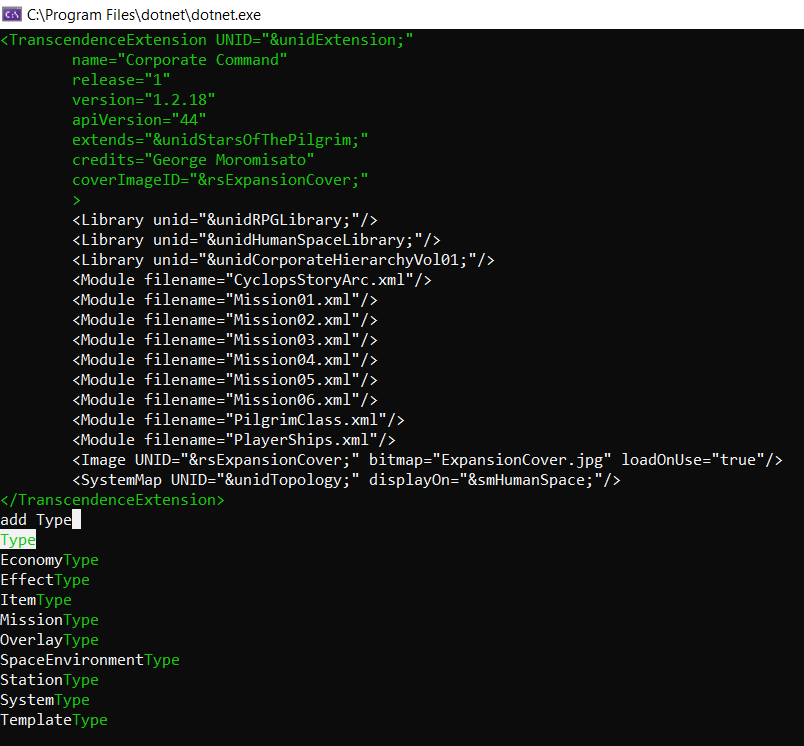

# Transgenesis-II
Terminal-based XML editor that makes sure your XML fits the structure defined in a template file. Lets you manage elements and set attributes while skipping the manual navigation of a regular text editor. Auto-suggests attributes and elements according to the template, and also attribute values.

